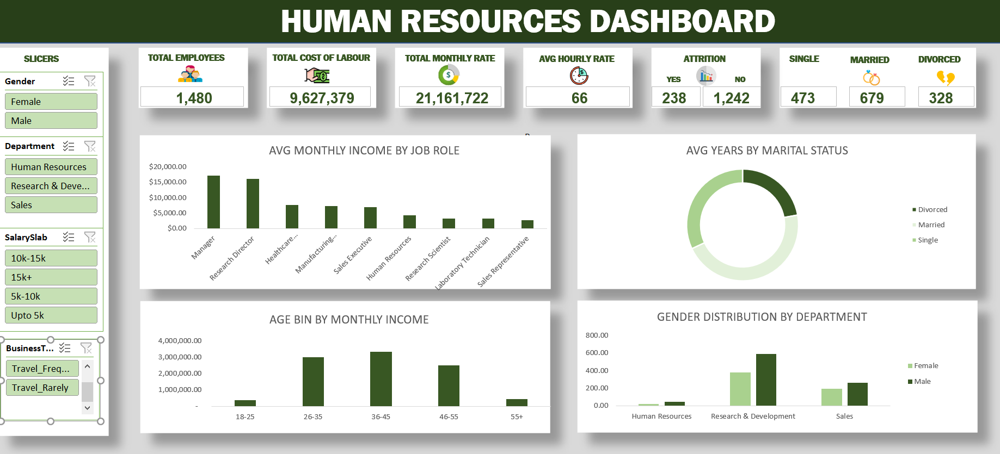

#  About Me

**I'm a Data Analyst passionate about transforming raw, messy data into meaningful insights that drive smarter business decisions. I enjoy solving business problems with data, building interactive dashboards, uncovering trends, and presenting insights in ways that everyone can understand. Whether it's Excel, SQL, Power BI, or Python, I love turning numbers into clear stories that create real impact.**

## WHAT I DO

*As the Chief Analyst of SkillAhead Solutions Ltd, I provide consulting and training services for businesses and mentor aspiring analysts.*

**- ✅ Data Analytics Consulting.**
I provide in-depth analysis and tailored solutions to help you make data-driven decisions, optimize processes, and drive business growth. 

**- ✅ Staff Training & Development.**
I offer comprehensive training programs in data analysis, visualization, and data-driven decision-making. From beginner to advanced levels. 

<!--Section 2: List 3-4 key projects-->
## MY PORTFOLIO 

*A glimpse of some of the projects I've been working on.*

**Predictive Modeling and Hypothesis Testing using Titanic Dataset.**

The sinking of the Titanic is one of the most infamous shipwrecks in history.

[Read More](https://www.linkedin.com/pulse/predictive-modeling-hypothesis-testing-using-titanic-dataset-anietie/)

**Predictive Modeling and Hypothesis Testing using Titanic Dataset.**

On April 15, 1912, during her maiden voyage, the widely considered “unsinkable” RMS Titanic sank after colliding with an iceberg. 

[Read More](https://www.linkedin.com/pulse/predictive-modeling-hypothesis-testing-using-titanic-dataset-anietie/)

**Tracking sales across regions Online retail Dataset.**

United State has the highest sales , there weren’t enough lifeboats for everyone onboard, resulting in the death of 1502 out of 2224 passengers and crew. 

<a href="17 How to Present Data to Executives by Anietie Etuk.pdf">Download the Report here (pdf file)</a>

## CONTACT DETAILS

*Let’s connect and see how we can make a difference together!*
<table>
  <tbody>
    <tr>
      <td>📧</td>
      <td><a href="mailto:anietieetuk@gmail.com">anietieetuk@gmail.com</a></td>
    </tr>
    <tr>
      <td>📞</td>
      <td>(234) 816-763-7212</td>
    </tr>
    <tr>
      <td>📍</td>
      <td>PH, Nigeria</td>
    </tr>
    <tr>
      <td>⬇️</td>
      <td><a href="https://etuk123456.github.io/portfolio1/docs/Profile.pdf">Download my CV</a></td>
    </tr>
    <tr>
      <td>🌐</td>
      <td><a href="https://linkedin.com/in/etukanietie">The things I do daily on LinkedIn</a></td>
    </tr>
    <tr>
      <td>📺</td>
      <td><a href="https://www.youtube.com/@LearnwithEtuk">Watch my tutorials on YouTube</a></td>
    </tr>
  </tbody>
</table>

   

