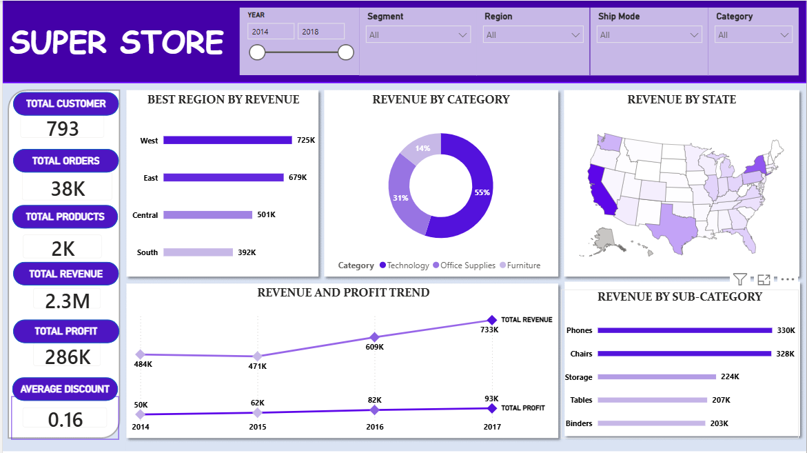
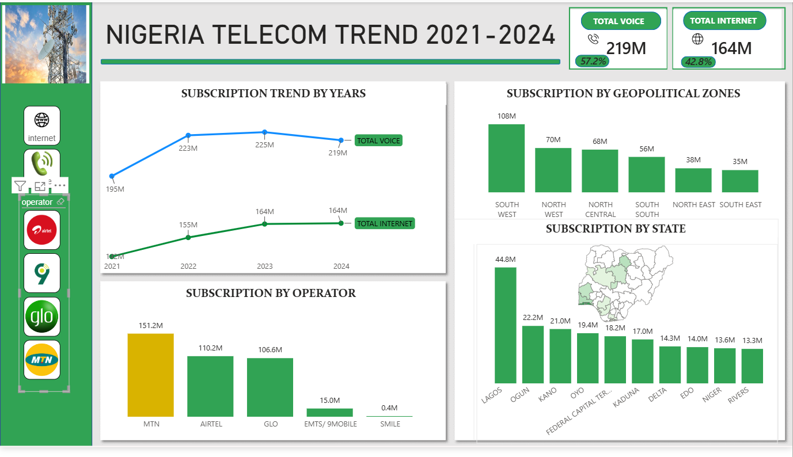
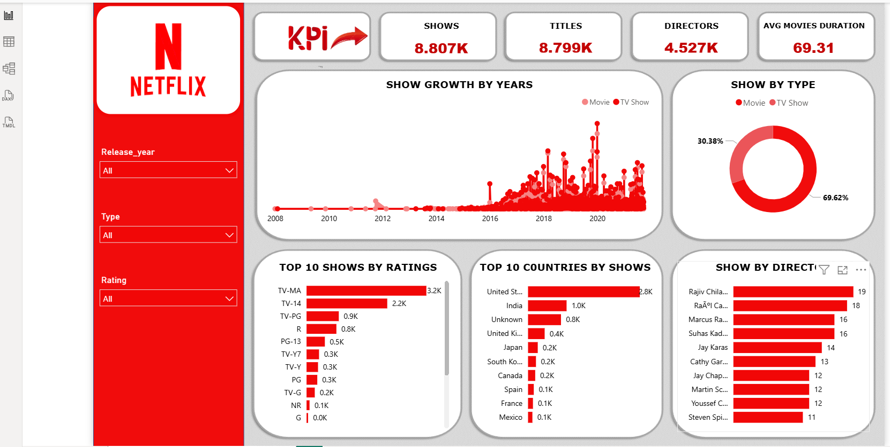
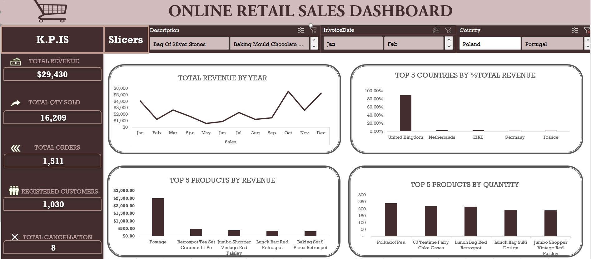

#  About Me

**I turn messy data into actionable insights and clear stories that drive smarter business decisions. Using Excel, SQL, Power BI, and Power point, I build dashboards, uncover trends, and deliver impact everyone can understand.**

## WHAT I DO

**As Data Analyst intern at Analyst Lab Africa I carry out Data Transformation, modeling and visualization using Excel, SQL and Power bi.**     

**Data Analytics Consulting.**
**I provide in-depth analysis and tailored solutions to help you make data-driven decisions, optimize processes, and drive business growth.** 

**                       **
I offer comprehensive training programs in data analysis, visualization, and data-driven decision-making. From beginner to advanced levels. 

<-->
## My Projects  

Here is a glimpse of some of the projects I've been working on.

**Superstore Sales Performance Dashboard**

Built an interactive Power BI dashboard 4 years (2014–2018) of Superstore sales data to uncover which regions, categories, and products were driving,or draining  profitability.

**Business Problem:** Revenue was growing steadily, but leadership had no visibility into where profit was leaking or which segments needed corrective action..
[Read More](https://www.linkedin.com/pulse/predictive-modeling-hypothesis-testing-using-titanic-dataset-anietiModeli*

**Nigeria Telecom Subscribers Trend Dashboard (2021–2024)**
Excel and Powerbi project.
Tracking voice and internet subscription trends across Nigeria's telecom market using NCC operator-level data.
Business Problem: On the surface, subscriber numbers look healthy  but a closer look at the year-over-year trend reveals a market shift that's easy to miss if you only glance at headline totals.

[Read More](https://www.linkedin.com/pulse/predictive-modeling-hypothesis-testing-using-titanic-dataset-anietie/)

** Business Analysis — Chinook Music Store DatabSQL**
Wrote SQL queries against the Chinook database to answer key business questions about customers, revenue, and product performance for a digital music store.
Problem: Raw invoice and customer data needed to be turned into insights that could guide business decisions — who the most valuable customers are, which markets drive revenue, and what content sells best.

**Netflix Content Analysis Dashboard**

Built a Power BI dashboard analyzing Netflix's content catalog to uncover patterns in show growth, ratings, and global content distribution.
**Problem:** With thousands of titles across countries, genres, and formats, understanding what content strategy Netflix has followed  and where the catalog is concentrated  isn't obvious from raw data alone.
[Read More](

**Tracking sales across regions Online retail Dataset.**

United State has the highest sales , there weren’t enough lifeboats for everyone onboard, resulting in the death of 1502 out of 2224 passengers and crew. 

<a href="17 How to Present Data to Executives by Anietie Etuk.pdf">Download the Report here (pdf file)</a>

## CONTACT DETAILS

**Lets connect to unravel some mysteries together!**
<table>
  <tbody>
    <tr>
      <td>📧</td>
      <td><a href="mailto:abubakarfatimahbintu@gmail.com">abubakarfatimahbintu@gmail.com</a></td>
    </tr>
    <tr>
      <td>Contact</td>
      <td>(234) 814-447-9553</td>
    </tr>
    <tr>
      <td>Location</td>
      <td>Edo State, Nigeria</td>
    </tr>
    <tr>
      <td>CV</td>
      <td><a href="https://">Download my CV</a></td>
    </tr>
    <tr>
      <td>🌐</td>
      <td><a href="www.linkedin.com/in/
data-driven
">The things I do daily on LinkedIn</a></td>
    </tr>
    <tr>
      <td>📺</td>
      <td><a href="https://www.youtube.com/@LearnwithEtuk">Watch my tutorials on YouTube</a></td>
    </tr>
  </tbody>
</table>

   

