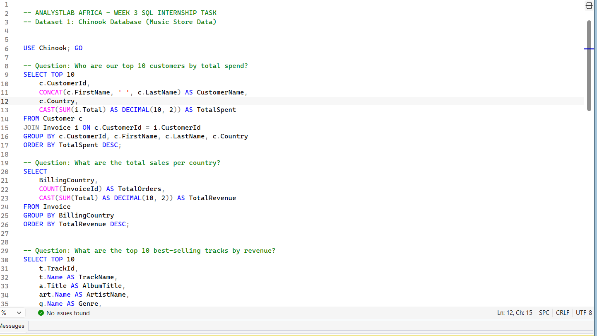

#  About Me

**I turn messy data into actionable insights and clear stories that drive smarter business decisions. Using Excel, SQL, Power BI, and Power point, I build dashboards, uncover trends, and deliver impact everyone can understand.**

## WHAT I DO

**As Data Analyst intern at Analyst Lab Africa I carry out Data Transformation, modeling and visualization using Excel, SQL and Power bi.**     

## My Projects  

Here is a glimpse of some of the projects I've been working on.

**Superstore Sales Performance Dashboard**

Built an interactive Power BI dashboard 4 years (2014–2018) of Superstore sales data to uncover which regions, categories, and products were driving,or draining  profitability.

*Business Problem:* Revenue was growing steadily, but leadership had no visibility into where profit was leaking or which segments needed corrective action..
[Read More](

**Nigeria Telecom Subscribers Trend Dashboard (2021–2024)**

Excel and Powerbi project.
Tracking voice and internet subscription trends across Nigeria's telecom market using NCC operator-level data.

*Business Problem:* On the surface, subscriber numbers look healthy  but a closer look at the year-over-year trend reveals a market shift that's easy to miss if you only glance at headline totals.
[Read More](https://www.linkedin.com/posts/fatimah-bintu-abubakar_3mtt-dataanalytics-powerbi-activity-7496184686495420416-1WdP?utm_source=share&utm_medium=member_android&rcm=ACoAAEoNgjgBKRYZXISBC28P9RFEUrVT0QokkKg

**Business Analysis,Chinook Store**

Wrote SQL queries against the Chinook database to answer key business questions about customers, revenue, and product performance for a digital music store

*Problem*: Raw invoice and customer data needed to be turned into insights that could guide business decisions — who the most valuable customers are, which markets drive revenue, and what content sells best.
[Read]
(DatabaseSQL://www.linkedin.com/posts/fatimah-bintu-abubakar_sql-dataanalytics-analystlabafrica-activity-7486812389988876288-ss85?utm_source=share&utm_medium=member_android&rcm=ACoAAEoNgjgBKRYZXISBC28P9RFEUrVT0QokkKg)

**Netflix Content Analysis Dashboard**

Built a Power BI dashboard analyzing Netflix's content catalog to uncover patterns in show growth, ratings, and global content distribution.

*Problem* With thousands of titles across countries, genres, and formats, understanding what content strategy Netflix has followed  and where the catalog is concentrated  isn't obvious from raw data alone.
[Read More](https://www.linkedin.com/posts/fatimah-bintu-abubakar_dataanalytics-powerbi-datavisualization-activity-7483758617146462208-OtlO?utm_source=share&utm_medium=member_android&rcm=ACoAAEoNgjgBKRYZXISBC28P9RFEUrVT0QokkKg)

**Tracking sales across regions Online retail Dataset.**

End to End Excel project using, Functions and Formulas like V-lookup,Sumif,Countif,Pivot tables, Pivot Charts etc to answer core business questions like:
Best selling products, Which year generated more revenue?, Which product is generating more revenue?
[Read More](https://www.linkedin.com/posts/fatimah-bintu-abubakar_dataanalytics-businessintelligence-retail-activity-7472826840882089984-xxK7?utm_source=share&utm_medium=member_android&rcm=ACoAAEoNgjgBKRYZXISBC28P9RFEUrVT0QokkKg)

## CONTACT DETAILS
<table>
  <tbody>
    <tr>
      <td>Email</td>
      <td><a href="mailto:abubakarfatimahbintu@gmail.com">abubakarfatimahbintu@gmail.com</a></td>
    </tr>
    <tr>
      <td>Contact</td>
      <td>(+234) 8144479553</td>
    </tr>
    <tr>
      <td>Location</td>
      <td>Edo State, Nigeria</td>
    </tr>
    <tr>
      <td>CV</td>
      <td><a href="https://">Download my CV</a></td>
    </tr>
    <tr>
      <td>LinkedIn</td>
    </tr>
  </tbody>
</table>

   

